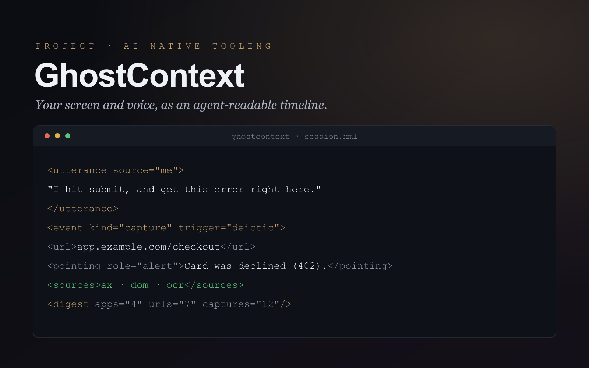

<p align="center">
  
</p>

# 👻 GhostContext

**Narrate what you're doing on screen; get back structured text your AI agent can read.**

GhostContext is a lightweight macOS background app that silently watches a live
session — your screen, your apps, and what you say out loud — and turns it into a
compact, timestamped **XML timeline** a text-based AI agent (Claude, Cursor, etc.)
can ingest to understand exactly what happened and what you were referring to.

Think of it as a screen recording, but in structured text instead of pixels:
token-efficient, precise, and instantly readable by an LLM — whether you're filing a
bug, running a QA pass, debugging code, or narrating a user interview.

## Contents

- [The problem](#the-problem)
- [How it works](#how-it-works)
- [Use cases](#use-cases)
- [Features](#features)
- [Example output](#example-output)
- [Extraction layers](#extraction-layers)
- [Install](#install)
- [Usage](#usage) — [`gcrecord`](#gcrecord--the-one-liner) · [web panel](#web-control-panel) · [CLI](#cli)
- [Local HTTP API](#local-http-api)
- [MCP server](#mcp-server)
- [Configuration](#configuration)
- [Limitations](#limitations)
- [Roadmap](#roadmap)

## The problem

Whenever you need to hand off *"what just happened on screen"* — to an AI agent, a
bug ticket, or a teammate — the options are bad:

- **Screen recordings** are huge, and most coding/text agents can't watch video at
  all; multimodal is slow, lossy, and expensive for this.
- **Manual notes & screenshots** interrupt your flow and always miss something.
- **Time-based screen scraping** floods you with duplicate frames when nothing
  changes and still misses the fast moments.

And in every case the crucial link is lost: *what you were pointing at when you said
"this."*

## How it works

Capture the session **as it happens**, as clean structured text:

- **Event-driven, not polling.** Reacts to real events — window/app switches,
  clicks, scrolls — instead of sampling on a timer. Never misses a fast interaction,
  never logs a redundant frame.
- **Voice-triggered captures.** Say a pointer phrase like *"look at this"* or
  *"right here"* and it snapshots what you were pointing at, mapping your words to
  the exact spot on screen — no manual screenshot button.
- **Layered extraction.** For each moment it fuses macOS **Accessibility**, the live
  **browser DOM**, **editor** file/line/snippet, and on-device **OCR**, and records
  which layer produced each fact.
- **Delta compression.** Logs full state once, then only what changes — so a long
  stint on one screen costs almost nothing.
- **One file out.** Everything becomes a single XML timeline plus a short digest,
  designed to be read directly by a text model.

## Use cases

Any session where you're doing something on screen and talking through it. You just
narrate naturally — say a pointer word like *"here"* or *"look at this,"* and it
captures what you meant.

**🐞 Bug reports & QA runs — reproduce, don't record.**
> *"I fill in the form, hit submit, and I get this error right here."*

Captures the page URL, the click, the **error element and its exact text** (from the
DOM + OCR), and a screenshot. Attach the XML to a ticket or hand it to an agent and
the repro steps + precise error are already structured — no "works on my machine,"
no 5-minute video to scrub.

**👩‍💻 Coding & handoffs.**
> *"The bug is on this line right here."*

Captures the file path, cursor line, and a ~20-line snippet — so an agent can fix it
without you re-explaining which line you meant.

**🎙️ User interviews & UX research.**
> *"Notice they got stuck on this button here."*

Captures the screen, the element, and your verbatim observation, tied together by
timestamp — a searchable, quotable record instead of hours of video.

**🧭 Walkthroughs, demos & support.**
> *"To set this up, you click here, then over here."*

Turns a workflow into a clean step-by-step timeline of screens and actions you can
replay, share, or feed to an agent to script or document.

## Features

- **Silent background capture** with a small local **web control panel** — start /
  stop, a live transcript, and every setting in one place.
- **Real-time local speech-to-text** (faster-whisper) over your mic, and system
  audio too (via an aggregate device), speaker-attributed.
- **Editor-aware:** active file path, cursor line, and a ~20-line snippet read
  straight from disk.
- **Browser-aware:** the live DOM, including the **element directly under your
  cursor**, visible errors/alerts, and your current selection.
- **On-device OCR** (Apple Vision) of the region around your cursor — reaching text
  Accessibility and the DOM can't: canvas, native apps, images, video tiles.
- **Optional test mode** that also records a raw screen video + audio and muxes them
  into a single `demo-video.mp4` (keeping the separate files too).
- **Optional redaction** that scrubs emails, tokens, and keys before you share.
- **Drive it from anywhere:** a `gcrecord` command, a local HTTP API, and an **MCP
  server** so an AI agent can start/stop recordings and read them back.
- **100% local.** No cloud, no account, nothing leaves your machine.

## Example output

A voice-triggered capture from a QA run — the tester said *"…I get this error right
here"* while pointing at the page:

```xml
<utterance t="02:14.900" source="me">I fill in the form, hit submit, and I get this error right here.</utterance>
<event t="02:14.900" kind="capture" trigger="deictic" phrase="this error right here">
  <app name="Google Chrome" bundle="com.google.Chrome"/>
  <window title="Checkout — Storefront"/>
  <url>https://app.example.com/checkout</url>
  <dom>
    <pointing tag="div" role="alert" class="form-error">Card was declined (code 402).</pointing>
    <salient>
      <el tag="button">Place order</el>
      <el tag="input" aria="Card number"/>
    </salient>
  </dom>
  <sources>ax, dom, ocr</sources>
  <ocr region="cursor" image="screenshots/capture-02_14.png">Card was declined (code 402). · Place order</ocr>
  <cursor x="640" y="470"/>
</event>
```

Coding moments carry a `<code file="…" line="…">` block with a snippet instead of a
DOM. Routine moments compress to deltas (`<event kind="scroll" mode="delta">` with
just the cursor). The file closes with a `<digest>` summarizing every app, URL,
file, and capture — a TL;DR an agent can read before the full timeline.

## Extraction layers

GhostContext tries every signal, cheapest first, and tags each event's `<sources>`:

| Layer | What it reads | When |
|---|---|---|
| **ax**  | front app · window title · URL · editor file/line/snippet | every event |
| **dom** | live browser DOM: element under the cursor, visible errors, selection, salient controls (Chromium) | captures + keyframes |
| **ocr** | a screenshot cropped around the cursor, read locally by Apple Vision | captures (configurable) |

When you say *"look at this,"* the DOM element under your cursor, the Accessibility
context, and the OCR of the pixels around it resolve the target three independent
ways — so the agent isn't guessing.

**Why crop around the cursor instead of scraping the whole screen?** Full-screen OCR
every tick is noisy and token-heavy. A tight crop at the pointer, only on a capture,
is high-signal and tiny — "the thing I pointed at," not "everything on screen."

## Install

**Requirements:** macOS, and Python **3.9–3.12** (the speech engine's wheels don't
cover 3.13+ yet).

```bash
git clone https://github.com/a-finance-bro/ghostcontext.git
cd ghostcontext
python3.12 -m venv .venv && source .venv/bin/activate
pip install -e .          # installs the `gcrecord`, `ghostcontext`, `ghostcontext-mcp` commands
```

**Grant permissions** (System Settings → Privacy & Security → add your terminal):
Accessibility · Microphone · Screen Recording · Automation. For the browser-DOM
layer, also enable Chrome → View → Developer → *Allow JavaScript from Apple Events*.

**Both sides of a call (optional):** install [BlackHole](https://github.com/ExistentialAudio/BlackHole)
(`brew install blackhole-2ch`), create an Aggregate Device (your mic + BlackHole) in
Audio MIDI Setup, and pick it in the control panel. Mic-only works out of the box.

## Usage

### `gcrecord` — the one-liner

```bash
gcrecord            # start the balanced config; press Enter to stop
gcrecord --test     # also save raw screen + audio + a combined demo-video.mp4
```

Run it, work + narrate normally, then press **Enter**. It prints the output path,
length, and metrics (captures, events, files, URLs, screenshots) and opens the
session folder. Flags: `--test` · `--mock FILE` · `--device NAME` ·
`--region {cursor,window,full}` · `--no-dom` · `--no-ocr` · `--no-screenshots` ·
`--no-actions` · `--output DIR` · `--no-open`.

### Web control panel

```bash
ghostcontext --web        # opens http://127.0.0.1:8765
```

Live transcript, start/stop, and every layer/setting as toggles — good for tuning or
a guided demo.

### CLI

```bash
ghostcontext                     # live capture → sessions/session.xml
ghostcontext --mock demo.jsonl   # replay a transcript, no mic needed
ghostcontext --list-audio        # find your input device + channels
```

## Local HTTP API

While the panel/server is running (`ghostcontext --web`, or `--web --no-browser` for
headless), it exposes a small JSON API on `127.0.0.1:8765` so you can drive it from
any script or tool:

| Method | Path | Purpose |
|---|---|---|
| `POST` | `/api/start` | Start a session (body: `test_mode`, `dom`, `ocr`, `shot_mode`, `region`, `device`, `markers`, …) |
| `POST` | `/api/stop` | Stop; returns artifact paths |
| `GET`  | `/api/status` | Live state + transcript |
| `GET`  | `/api/sessions` | Summaries of past sessions |

```bash
curl -s localhost:8765/api/start -d '{"test_mode":false}'
curl -s localhost:8765/api/status | jq
curl -s -X POST localhost:8765/api/stop
```

## MCP server

Let an AI agent **start/stop recordings and read the captured session directly** —
e.g. "start recording, I'll show you the bug, then read it back and fix it."

**Install:**
```bash
pip install -e ".[mcp]"     # or: pip install mcp
```

**Register** with your MCP client (e.g. `claude_desktop_config.json`):
```json
{
  "mcpServers": {
    "ghostcontext": { "command": "ghostcontext-mcp" }
  }
}
```

**Tools:** `start_recording` · `stop_recording` · `recording_status` ·
`list_sessions` · `read_session` (returns the `session.xml` so the agent can ingest
what happened). The server spawns the local backend on demand; nothing leaves your
machine.

## Configuration

Everything is adjustable in the web panel (or `ghostcontext/config.py`): screenshot
**mode** (off / on captures / on window changes / on every event) · capture
**region** (cursor / window / full) · OCR on/off · keep screenshot PNGs · browser
DOM on/off · **redact** secrets · the deictic **marker** vocabulary · Whisper model ·
keyframe interval.

## Limitations

It's a young project, and honest about the edges:

- **Editor extraction is Accessibility-based** — rock-solid for VS Code / Cursor
  (file + line + on-disk snippet); Xcode exposes less.
- **Browser tab switches** emit no OS event, so they're captured on the next click.
- **Streaming STT** uses fixed windows; words can split at chunk boundaries.
- macOS only.

## Roadmap

- Companion editor extension for exact file/line/selection (no AX guessing).
- Browser extension for instant tab/URL + richer DOM context.
- Per-project marker vocabularies.
- One-shot "session → task" and "session → bug report" exports.

## License

MIT
